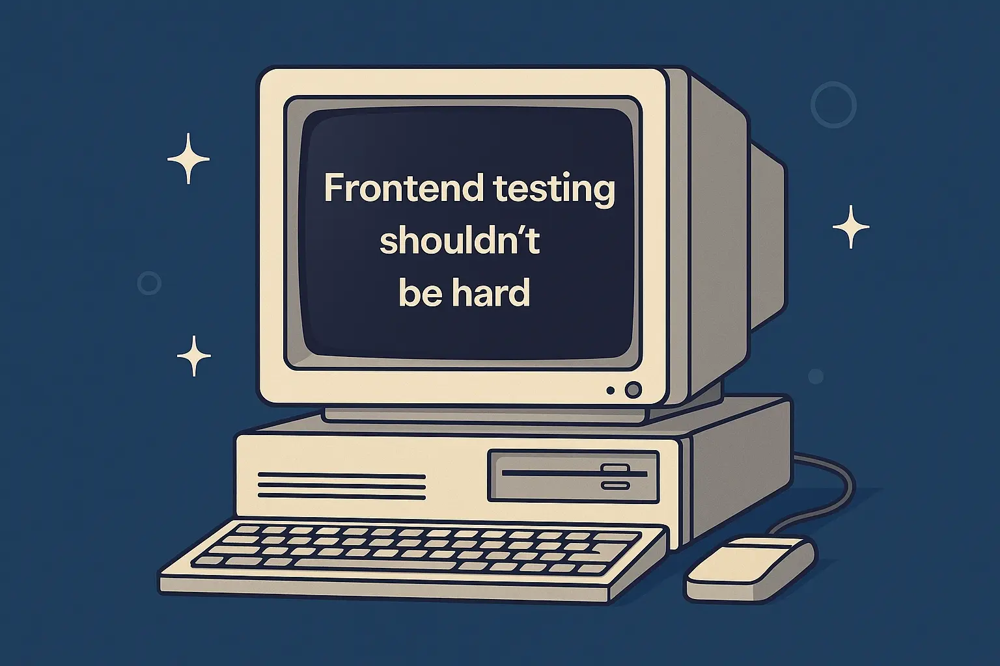

# Frontend Tests shouldn't be hard
Whenever I have been lucky enough to be a part of a frontend project, I have noticed how unwilling most people seem to be to test the UI's and components they have been writing.

Whether it’s been on the web, in an app, or in a native application, the excuses tend to be many: it takes extra time, the framework doesn’t support it, it’s too hard to recreate in a testing environment, and so on. The problem stems from the same issue though, and I don't want to sound harsh, but you might be writing your UIs incorrectly.

## Why though? I understand the code

Sure — *you* understand the code today. But codebases grow. Requirements change. People leave teams. And in six months, even you might not remember exactly why something was built a certain way. 

That’s where good tests _shine_: they aren’t just a safety net — they’re documentation. A well-written test tells the next person (or future you) what the component is supposed to do and why. It captures intent in a way that comments and git history never quite do. You're not just testing for yourself — you're building context for everyone who'll work with the code later.


## Presentation vs Logic

Whether you're building for web or native platforms, the principle stays the same: separate *what* your UI displays from *how* it behaves. On the web, Dan Abramov popularized this idea through his [presentational and container components](https://medium.com/@dan_abramov/smart-and-dumb-components-7ca2f9a7c7d0). In mobile development, it takes the form of the [MVVM pattern](https://swiderski.tech/2024-02-09-MVVM), as explained by Adam Świderski. Regardless of the platform, the goal is the same — narrow the responsibility of your UI layers.  

The most common issue I run into when reviewing frontend code is this: the UI does too much. It handles data, state, effects, and rendering all in one place — which makes it hard to test, hard to reason about, and harder to maintain.


### An example of what not to do

To see what this looks like in practice, let’s take a very simple example: a component that displays user data.

Here’s the common, “do-it-all” version you’ve probably seen (or written) before:

```typescript
function UserCard() {
  const [user, setUser] = useState(null)
  const [loading, setLoading] = useState(true)

  useEffect(() => {
    fetch('/api/user')
      .then(res => res.json())
      .then(data => {
        setUser(data)
        setLoading(false)
      })
  }, [])

  if (loading) return <p>Loading...</p>

  return (
    <div>
      <h2>{user.name}</h2>
      <p>{user.email}</p>
    </div>
  )
}
```

This component:

- Fetches data
- Manages state
- Handles side effects
- Renders the UI

It’s doing everything at once — which makes it harder to test, reuse, or reason about.

### An example of what to do instead
The solution? Split it into two components.

By splitting the component in two, we isolate concerns. `UserCardContainer` handles the logic — fetching data and managing state — while `UserCard` is a pure, presentational component. This makes `UserCard` trivial to test and easy to reuse with different data sources or mocked states.


```typescript
// Container: handles data logic
function UserCardContainer() {
  const [user, setUser] = useState(null)
  const [loading, setLoading] = useState(true)

  useEffect(() => {
    fetch('/api/user')
      .then(res => res.json())
      .then(data => {
        setUser(data)
        setLoading(false)
      })
  }, [])

  return <UserCard user={user} loading={loading} />
}
```


```typescript
// Presentational: renders only
function UserCard({ user, loading }) {
  if (loading) return <p>Loading...</p>

  return (
    <div>
      <h2>{user.name}</h2>
      <p>{user.email}</p>
    </div>
  )
}
```

### Testing the Presentational Component

By describing what the component *should do*, rather than how it’s implemented, we make our tests more resilient and expressive:

```typescript
describe('UserCard', () => {
  it('should show user name and email when not loading', () => {
    render(
      <UserCard
        user={{ name: 'Butters', email: 'mcGee@example.com' }}
        loading={false}
      />
    )

    expect(screen.getByText('Butters')).toBeInTheDocument()
    expect(screen.getByText('mcGee@example.com')).toBeInTheDocument()
  })

  it('should show a loading message when loading is true', () => {
    render(<UserCard user={null} loading={true} />)

    expect(screen.getByText('Loading...')).toBeInTheDocument()
  })
})
```
You can also, if you're a [red, green, refactor](https://www.codecademy.com/article/tdd-red-green-refactor) person, already see how helpful this is. The test describes what the component *should do*, so writing the UI becomes more about fulfilling expectations than guessing at behavior.  


## It's Not Always You — Your Testing Framework Will Have Gaps

I have a friend — who I won’t name — who hates [jsdom](https://github.com/jsdom/jsdom).  And I get it. It handles most DOM APIs well, but it doesn’t support everything. Features like `ResizeObserver`, `IntersectionObserver`, or canvas-related rendering often need to be mocked or polyfilled to work reliably in tests.

Animations, third-party libraries (like Lottie), or layout-measuring logic can also behave differently under test than in a real browser. That’s okay — the goal isn’t to perfectly replicate the runtime environment. The goal is to test **your intent**: given a certain input or interaction, does the component behave the way you expect?

You still around? Wow! Good job. I hope it brought you some good insights, if you disagree or want to continue this conversation, you can find me on [mastodon](https://fosstodon.org/@sendcookies).

Signing out,

Paul