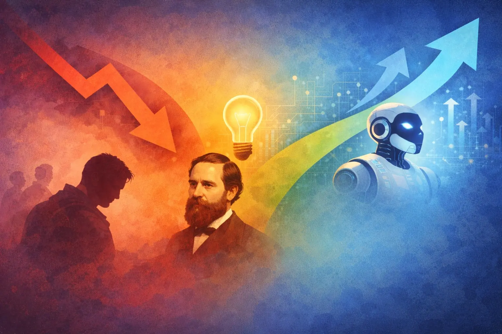

# The Layoff Math Doesn't Add Up: What Jevons Paradox Tells Us About AI and Software Engineers

There's a certain kind of executive decision that looks absolutely brilliant in a spreadsheet and reveals itself to be catastrophic somewhere around Q3. Right now, companies are looking at AI-powered productivity gains, concluding they need fewer engineers, and handing out pink slips with the kind of confidence usually reserved for people who've never been wrong about anything before.

It's tidy logic. It's also almost certainly wrong, and there's a 160-year-old economic principle that explains why. But hey, who needs history when you have a slide deck?

## The Math That "Makes Sense"

The pattern is painfully familiar: a company adopts AI coding tools, engineers ship faster, and someone in a leadership meeting (who definitely codes, trust me) points out that if each engineer is 30% more productive, you theoretically need 30% fewer of them.

A round of layoffs follows, framed as "right-sizing for the AI era." The stock price ticks up momentarily. Everyone congratulates themselves. LinkedIn lights up with "humbled and excited to announce my next chapter" posts from people who just lost their jobs.

This is where the press release ends, but nowhere near where the story does.

## A Victorian Economist Would Like a Word

In 1865, economist William Stanley Jevons noticed something deeply counterintuitive about the newly-efficient steam engines of the Industrial Revolution. More efficient engines, ones that used less coal to do the same work, didn't reduce total coal consumption. They *increased* it. Dramatically.

Cheaper, more efficient energy didn't just replace existing use. It unlocked entirely new uses that hadn't been economically viable before. This became known as the **Jevons Paradox**, and it has held embarrassingly true across industry after industry ever since. You'd think we'd have learned by now. You'd be wrong.

## Software Is Coal (Hear Me Out)

The dynamic is identical with software. AI has dramatically reduced the cost of producing software: in time, effort, and headcount. Classic Jevons setup.

And if history is any guide (which, again, we apparently don't read) the response to cheaper software production won't be "let's produce the same amount with fewer people." It'll be "we can now afford to build all those things we've been putting off for the last three years."

The demand for software doesn't stay fixed when production costs drop. It expands to fill the newly available capacity, and then some. That ever-present backlog of ideas that never quite made the business case? It just became tractable. The feature you shelved in 2022 because it wasn't worth the headcount? Suddenly it is. Your competitors are figuring out the same thing, right now, while you're busy right-sizing.

## "But the AI Writes the Code Now"

Ah yes. The skills dimension the productivity-math argument conveniently ignores entirely.

AI tools are powerful. Genuinely impressive, actually. But they are not a replacement for engineering *judgment*. Someone still has to decide what to build. Someone has to review AI-generated code for correctness, security issues, and long-term maintainability, because the AI will absolutely produce plausible-looking code that is wrong in subtle and exciting ways 😬.

Someone has to debug the production failures that no AI anticipated, because no AI knows your specific combination of legacy quirks, undocumented business logic, and that one microservice Dave wrote in 2019 that nobody is allowed to touch.

These responsibilities don't disappear as output increases. They become *more* critical. More code with less oversight isn't efficiency. It's just faster accumulation of problems you'll have to fix later. Probably with fewer engineers. Good luck with that.

## The Competitive Math Nobody's Running

Companies firing engineers to capture short-term savings are also making a quiet bet that the competitive landscape will stay static. It won't.

AI tooling is available to everyone. Your competitors get the same efficiency gains. The winners won't be the ones who used AI to cut costs. They'll be the ones who used it to build faster and move into opportunities they previously couldn't afford to pursue.

Showing up to that race having already cut your engineering capacity is a bold strategy. Bold in the way that skipping training before a marathon is bold.

## So What Should You Actually Do?

Hold onto your engineers. Invest in their AI tooling. Get ready to use all that unlocked capacity, because the demand is coming whether you're staffed for it or not.

The companies that will look back on this period with satisfaction won't be the ones who cut the fastest. They'll be the ones who understood that cheaper production doesn't mean you need less. It means you can finally afford to do *more*.

But by all means, trust the spreadsheet. I'm sure it'll work out fine.

---

That's all for me for today, thanks for reading! ❤️

Signing out!

**Paul**

_____
**Editor's note:**

Thanks to Joakim Sköld for pointing me towards the Jevons Paradox in the first place.
