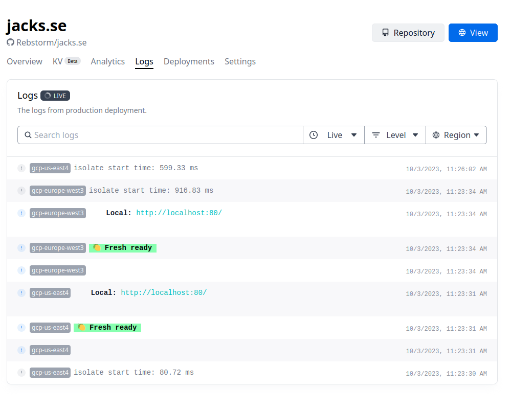

# Deploying Sarcasm Globally with Deno Deploy

One sunny weekend, when the outside world possibly expected the pleasure of my company, I instead delved into the cozy confines of my dev environment, armed with a strong coffee and a curiosity for Deno & Deno Deploy. Spoiler: No regrets were had.

## Enter the Deno-sphere

Before we get into the shenanigans of my weekend, let’s chat briefly about Deno for the uninitiated. Conjured into existence by Ryan Dahl (yeah, the Node.js wizard), Deno is essentially Node’s sassier younger sibling who learned from all of Node’s “life experiences” (read: issues).

- **Security**: Deno doesn’t trust you, and frankly, neither do I. It’s secure by default, no file, network, or environment access unless you say pretty please (enable it).
- **All-in-One**: It packs its lunch, with built-in utilities meaning fewer packages to manage.
- **TypeScript**: It speaks TypeScript natively without any babeling around.

## Deno Deploy, or How I Learned to Stop Worrying and Love the Edge

Taking a leap from local to global is where Deno Deploy waltzes in. Let’s tear down the fancy jargon and keep it simple, shall we?

### Global Distribution

“Edge Computing” - A fancy term that means your code runs worldwide, closer to your users, and not just from your rickety basement server.

### A Dev-Friendly Lingo

Deno Deploy respects the **O** in SOLID. It speaks fluent TypeScript and JavaScript, allows for a myriad of standard APIs, and still maintains its integrity (security-wise).

### Real-Time Debugging That Doesn’t Suck

Honestly, logs can be a nightmare, but not here. Behold, the beauty of clean, real-time debugging:

_A visual treat, isn’t it? Alright, fine, they could respect `prefers-dark-mode`!_

### Let’s Get Deploying

```typescript
import { serve } from 'https://deno.land/x/deploy/mod.ts';

const requestListener = async (request: Request) => {
  const { pathname } = new URL(request.url);

  return new Response(`Hello, world! You visited ${pathname}.`, {
    headers: { 'content-type': 'text/plain' },
  });
};

serve(requestListener);
```

Deploy? Just zip over to Deno Deploy, whip up a new project, and push your script into the digital abyss. It’ll emerge on the other side as a globally available, buttery smooth user experience.
## Summing Up: Deno + Deno Deploy = 😘👌

So, Deno and Deno Deploy? Quite the power couple. They pave the way for simplified, scalable, and satisfyingly smooth JavaScript and TypeScript development with nearly as much effort as I put into my coffee choice.

If you’re looking for tech that brings secure, scalable, and splendidly streamlined development into your life, take Deno and Deno Deploy for a spin. They are not merely participants in the tech arena; they’re starting to run the show. 🚀


PS: Stay sassy but always keep checking the Deno website and Deno Deploy docs for all the fresh updates and features to enhance your deploy escapades.

PPS. Was this too much sarcasm? I have a hard time finding balance sometimes. 

Note: The code snippets aren’t just for show - do give them a whirl, but with the cautious optimism of any seasoned developer, considering API evolutions and all that jazz.